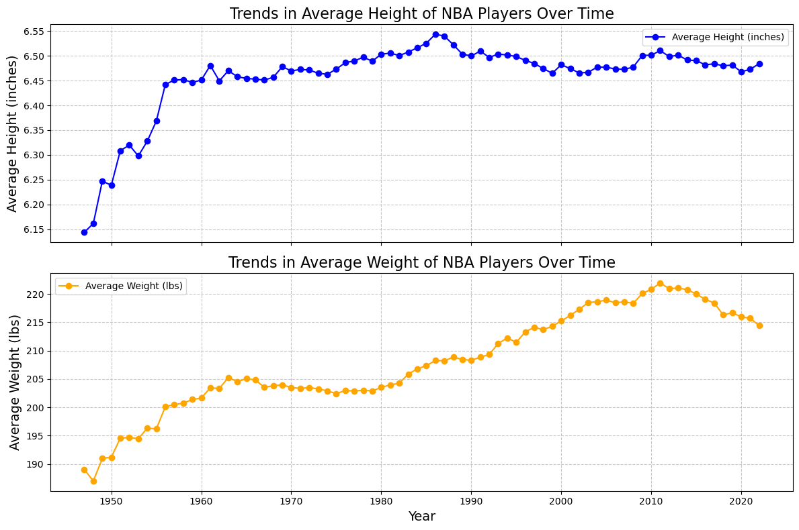

# Assignment 2. Data Acquirance and Statistical Tests
In the first part of this homework, you are going to get familiar with Python tools used for web scraping and data crawling. Next, you will thoroughly investigate the tools and methods frequently used in statistics.

    

