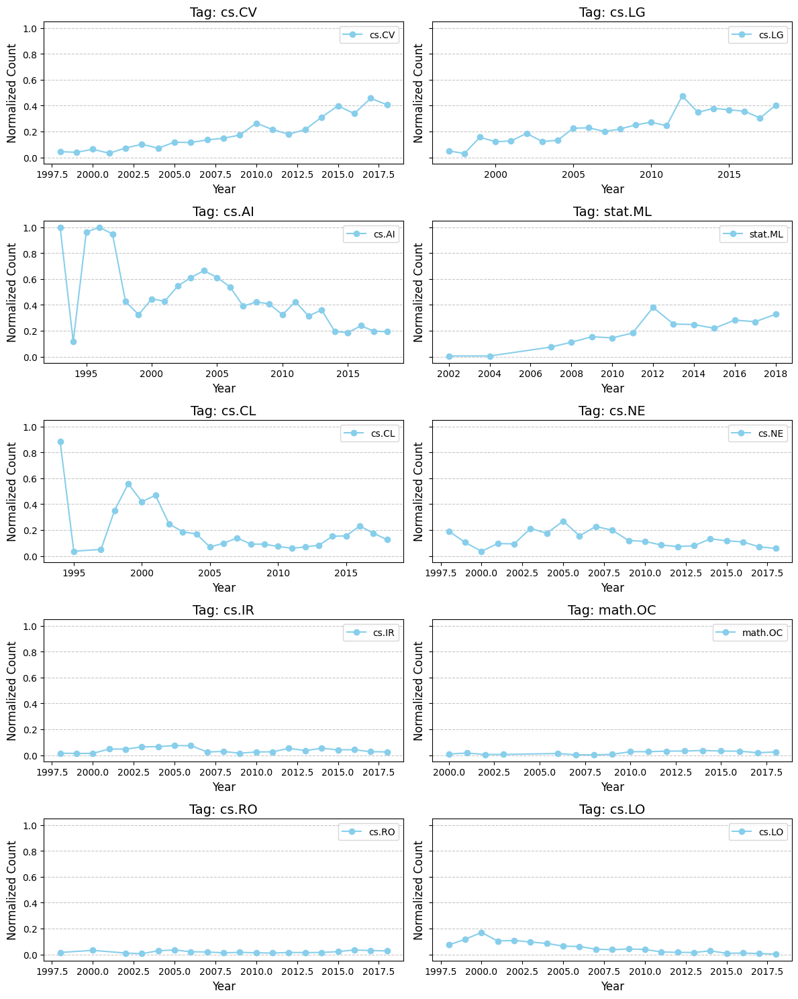
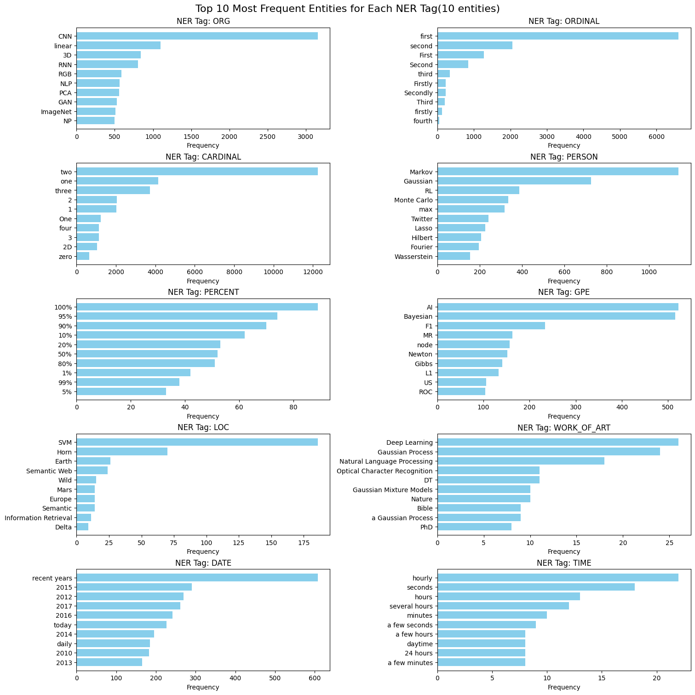

# Assignment 5. NLP and Deployment

    
    

deeplearning Model Build progress: |█████████████████████████████████████████████| (done) 100%
Model Details
=============
H2ODeepLearningEstimator : Deep Learning
Model Key: DeepLearning_model_python_1738063334959_21

Status of Neuron Layers: predicting y, 13-class classification, multinomial distribution, CrossEntropy loss, 17,293 weights/biases, 216.8 KB, 164,000 training samples, mini-batch size 1
    layer    units    type              dropout    l1     l2     mean_rate             rate_rms               momentum    mean_weight           weight_rms           mean_bias            bias_rms
--  -------  -------  ----------------  ---------  -----  -----  --------------------  ---------------------  ----------  --------------------  -------------------  -------------------  -------------------
    1        50       Input             20.0
    2        128      RectifierDropout  50.0       1e-05  1e-05  0.008417022127432575  0.0028772642835974693  0.0         0.002870283304158079  0.10513538122177124  0.46688035439912795  0.07747972011566162
    3        64       RectifierDropout  50.0       1e-05  1e-05  0.004596582032135643  0.0018043243326246738  0.0         -0.0157356590813183   0.10189893841743469  0.9500017085336778   0.15532439947128296
    4        32       RectifierDropout  50.0       1e-05  1e-05  0.001292570269299631  0.0007915960159152746  0.0         -0.04646596368821887  0.12987995147705078  0.7295963856670047   0.07554659247398376
    5        13       Softmax                      1e-05  1e-05  0.2758061078051329    0.4110058546066284     0.0         -0.2688512680503244   0.8159489631652832   -10.502294597058762  2.214594841003418

ModelMetricsMultinomial: deeplearning
** Reported on train data. **

MSE: 0.0960881989566209
RMSE: 0.3099809654746899
LogLoss: 0.4778721415703415
Mean Per-Class Error: 0.9230769230769231
AUC table was not computed: it is either disabled (model parameter 'auc_type' was set to AUTO or NONE) or the domain size exceeds the limit (maximum is 50 domains).
AUCPR table was not computed: it is either disabled (model parameter 'auc_type' was set to AUTO or NONE) or the domain size exceeds the limit (maximum is 50 domains).

Confusion Matrix: Row labels: Actual class; Column labels: Predicted class
2004.0    2005.0    2008.0    2009.0    2011.0    2012.0    2013.0    2014.0    2015.0    2016.0    2017.0    2018.0    nan    Error      Rate
--------  --------  --------  --------  --------  --------  --------  --------  --------  --------  --------  --------  -----  ---------  -----------
0         0         0         0         0         0         0         0         0         0         0         0         1      1          1 / 1
0         0         0         0         0         0         0         0         0         0         0         0         1      1          1 / 1
0         0         0         0         0         0         0         0         0         0         0         0         1      1          1 / 1
0         0         0         0         0         0         0         0         0         0         0         0         1      1          1 / 1
0         0         0         0         0         0         0         0         0         0         0         0         4      1          4 / 4
0         0         0         0         0         0         0         0         0         0         0         0         10     1          10 / 10
0         0         0         0         0         0         0         0         0         0         0         0         18     1          18 / 18
0         0         0         0         0         0         0         0         0         0         0         0         33     1          33 / 33
0         0         0         0         0         0         0         0         0         0         0         0         29     1          29 / 29
0         0         0         0         0         0         0         0         0         0         0         0         72     1          72 / 72
0         0         0         0         0         0         0         0         0         0         0         0         96     1          96 / 96
0         0         0         0         0         0         0         0         0         0         0         0         36     1          36 / 36
0         0         0         0         0         0         0         0         0         0         0         0         2978   0          0 / 2,978
0         0         0         0         0         0         0         0         0         0         0         0         3280   0.0920732  302 / 3,280

Top-10 Hit Ratios: 
k    hit_ratio
---  -----------
1    0.907927
2    0.937195
3    0.959756
4    0.969207
5    0.978049
6    0.984451
7    0.994512
8    0.994817
9    0.998171
10   0.999085

ModelMetricsMultinomial: deeplearning
** Reported on validation data. **

MSE: 0.036279972761878984
RMSE: 0.19047302371170302
LogLoss: 0.21346918708279317
Mean Per-Class Error: 0.46153846153846156
AUC table was not computed: it is either disabled (model parameter 'auc_type' was set to AUTO or NONE) or the domain size exceeds the limit (maximum is 50 domains).
AUCPR table was not computed: it is either disabled (model parameter 'auc_type' was set to AUTO or NONE) or the domain size exceeds the limit (maximum is 50 domains).

Confusion Matrix: Row labels: Actual class; Column labels: Predicted class
2004.0    2005.0    2008.0    2009.0    2011.0    2012.0    2013.0    2014.0    2015.0    2016.0    2017.0    2018.0    nan    Error      Rate
--------  --------  --------  --------  --------  --------  --------  --------  --------  --------  --------  --------  -----  ---------  --------
0         0         0         0         0         0         0         0         0         0         0         0         0      nan        0 / 0
0         0         0         0         0         0         0         0         0         0         0         0         0      nan        0 / 0
0         0         0         0         0         0         0         0         0         0         0         0         0      nan        0 / 0
0         0         0         0         0         0         0         0         0         0         0         0         0      nan        0 / 0
0         0         0         0         0         0         0         0         0         0         0         0         1      1          1 / 1
0         0         0         0         0         0         0         0         0         0         0         0         0      nan        0 / 0
0         0         0         0         0         0         0         0         0         0         0         0         2      1          2 / 2
0         0         0         0         0         0         0         0         0         0         0         0         1      1          1 / 1
0         0         0         0         0         0         0         0         0         0         0         0         3      1          3 / 3
0         0         0         0         0         0         0         0         0         0         0         0         10     1          10 / 10
0         0         0         0         0         0         0         0         0         0         0         0         7      1          7 / 7
0         0         0         0         0         0         0         0         0         0         0         0         0      nan        0 / 0
0         0         0         0         0         0         0         0         0         0         0         0         796    0          0 / 796
0         0         0         0         0         0         0         0         0         0         0         0         820    0.0292683  24 / 820

Top-10 Hit Ratios: 
k    hit_ratio
---  -----------
1    0.970732
2    0.979268
3    0.991463
4    0.992683
5    0.996341
6    0.99878
7    0.99878
8    0.99878
9    0.99878
10   1

Scoring History: 
    timestamp            duration    training_speed    epochs    iterations    samples    training_rmse    training_logloss    training_r2    training_classification_error    training_auc    training_pr_auc    validation_rmse    validation_logloss    validation_r2    validation_classification_error    validation_auc    validation_pr_auc
--  -------------------  ----------  ----------------  --------  ------------  ---------  ---------------  ------------------  -------------  -------------------------------  --------------  -----------------  -----------------  --------------------  ---------------  ---------------------------------  ----------------  -------------------
    2025-01-28 18:11:36  0.000 sec                     0         0             0          nan              nan                 nan            nan                              nan             nan                nan                nan                   nan              nan                                nan               nan
    2025-01-28 18:11:37  0.803 sec   26537 obs/sec     5         1             16400      0.324341         0.504064            0.911662       0.0920732                        nan             nan                0.218285           0.257242              0.877518         0.0292683                          nan               nan
    2025-01-28 18:11:39  3.062 sec   57665 obs/sec     50        10            164000     0.309981         0.477872            0.919311       0.0920732                        nan             nan                0.190473           0.213469              0.906741         0.0292683                          nan               nan

Variable Importances: 
variable    relative_importance    scaled_importance    percentage
----------  ---------------------  -------------------  --------------------
3           1.0                    1.0                  0.023182192926908162
17          0.9893407821655273     0.9893407821655273   0.022935088882619477
33          0.9617918133735657     0.9617918133735657   0.02229644337314685
16          0.9553712010383606     0.9553712010383606   0.02214759949928324
19          0.9351453185081482     0.9351453185081482   0.021678719188350872
36          0.9246121644973755     0.9246121644973755   0.021434537579944304
10          0.919084906578064      0.919084906578064    0.021306403620502044
14          0.9180153012275696     0.9180153012275696   0.02128160782291123
41          0.9129170179367065     0.9129170179367065   0.021163418436066412
43          0.9115728735923767     0.9115728735923767   0.021132258222554545
---         ---                    ---                  ---
29          0.8127350807189941     0.8127350807189941   0.018840981439694
12          0.8092756867408752     0.8092756867408752   0.018760785101083064
13          0.8086252212524414     0.8086252212524414   0.018745705884637896
6           0.7986679077148438     0.7986679077148438   0.018514873521175593
15          0.7952885627746582     0.7952885627746582   0.018436532894805638
5           0.7903591394424438     0.7903591394424438   0.018322258052099843
32          0.7784793972969055     0.7784793972969055   0.018046859577760054
27          0.7761475443840027     0.7761475443840027   0.017992802113655965
7           0.7717216610908508     0.7717216610908508   0.01789020043328214
46          0.7387369275093079     0.7387369275093079   0.017125541975752143
[50 rows x 4 columns]