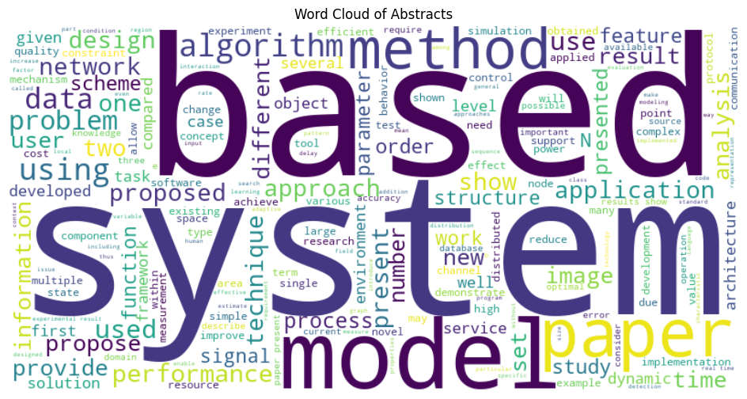
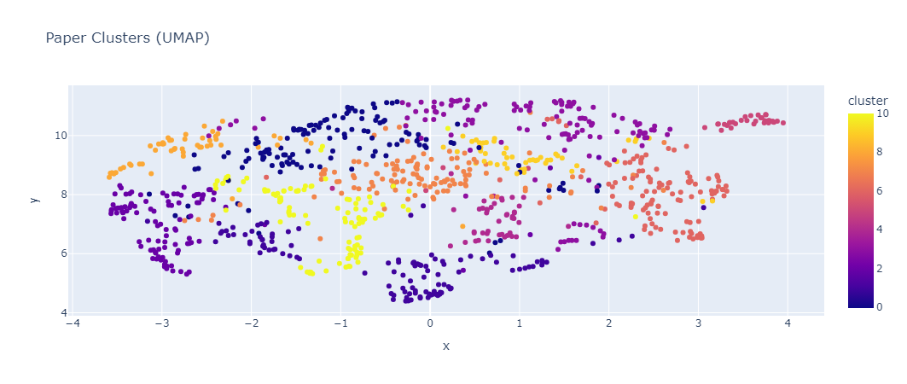

# Phase 1: Implementation
## EDA
### Basic
<div style="text-align: center;">
    
</div>

### BasicNetwork Analysis
<div style="text-align: center;">
    
</div>

## Data Extrapolation via Clustering
### Community Detection
```markdown
Community Sizes: [1, 2, 431, 467, 277, 1, 882, 592, 6, 15, 595, 1, 3, 5, 2, 1,...
Top 10 Authors in Largest Community: ['Kai Lei', 'Fangxing Zhu', 'Cheng Peng', 'Kuai Xu', 'Hao Li', 'Xuan Guo', 'Le Chen', 'Guantao Chen', 'Yi Pan', 'Zhenzhong Chen']
```
### Naming the Communities
<div>
<style scoped>
    .dataframe tbody tr th:only-of-type {
        vertical-align: middle;
    }

    .dataframe tbody tr th {
        vertical-align: top;
    }

    .dataframe thead th {
        text-align: right;
    }
</style>
<table border="1" class="dataframe">
  <thead>
    <tr style="text-align: right;">
      <th></th>
      <th>Community</th>
      <th>Top_Keywords</th>
      <th>Name</th>
    </tr>
  </thead>
  <tbody>
    <tr>
      <th>0</th>
      <td>541</td>
      <td>[(3d, 0.0), (adaptive, 0.0), (agent, 0.0), (al...</td>
      <td>Service &amp; Interference</td>
    </tr>
    <tr>
      <th>1</th>
      <td>91</td>
      <td>[(3d, 0.0), (adaptive, 0.0), (agent, 0.0), (al...</td>
      <td>Interference &amp; Noise</td>
    </tr>
    <tr>
      <th>2</th>
      <td>1</td>
      <td>[(3d, 0.0), (adaptive, 0.0), (agent, 0.0), (al...</td>
      <td>Learning Research Collective</td>
    </tr>
    <tr>
      <th>3</th>
      <td>2</td>
      <td>[(3d, 0.5749793592988639), (adaptive, 0.0), (a...</td>
      <td>Testing &amp; 3D</td>
    </tr>
    <tr>
      <th>4</th>
      <td>123</td>
      <td>[(3d, 0.0), (adaptive, 0.0), (agent, 0.0), (al...</td>
      <td>Scheduling &amp; Nonlinear</td>
    </tr>
  </tbody>
</table>
</div>

### Paper-Paper Clustering via Embedding 
<div style="text-align: center;">
    
</div>

## Citation Regressor
### Regressor
```markdown
Top Predicted Citations:
                                                  title  year  \
6131  DSI-Net: Deep Synergistic Interaction Network ...  2021   
1077  Uni-ControlNet: All-in-One Control to Text-to-...  2023   
246   Anchor Diffusion for Unsupervised Video Object...  2019   

                 topic  predicted_citations  
6131               LLM         1.189171e+13  
1077  Diffusion Models         8.380618e+12  
246   Diffusion Models         3.803213e+12
```
### Author-Author Network
The idea is that scholarly paper authors have relations with each other that may be a great
predictor of how many citations a given paper is going to have.
```markdown
Epoch 10/100, Loss: 3.7697
Epoch 20/100, Loss: 2.6772
Epoch 30/100, Loss: 1.7634
Epoch 40/100, Loss: 1.0372
Epoch 50/100, Loss: 0.5276
Epoch 60/100, Loss: 0.2340
Epoch 70/100, Loss: 0.1039
Epoch 80/100, Loss: 0.0525
Epoch 90/100, Loss: 0.0334
Epoch 100/100, Loss: 0.0260

Test Set Regression Metrics:
RMSE: 144.20
MAE: 60.33
R2 Score: -0.27

Top Predicted Citations:
                                                   title  year  \
4119   The Good, the Bad, and the Expert: How Consume...  2015   
4740   Chinese Term Recognition and Extraction Based ...  2008   
4045   High efficient hardware allocation framework o...  2015   
10845  Score-Based Generative Modeling through Stocha...  2020   
12922  Normalizing Flows for Probabilistic Modeling a...  2019   
15288                  Large language models in medicine  2023   
14175      Diffusion Models Beat GANs on Image Synthesis  2021   
15382  RePaint: Inpainting using Denoising Diffusion ...  2022   
16567   Vote-Selling: Infrastructure and Public Services  2018   
12577                    Squeeze-and-Excitation Networks  2017   

                   topic  predicted_citations  
4119                 NaN          2697.807129  
4740                 NaN          2314.161621  
4045                 NaN          1178.770020  
10845   Diffusion Models          1175.487061  
12922  Foundation Models          1165.278809  
15288  Generative Models          1165.196045  
14175  Generative Models          1120.444824  
15382  Generative Models          1099.473389  
16567                LLM           949.788086  
12577  Foundation Models           900.298340
```
## Product
We create a pipeline that takes a string input from the user, and will retrieve relevant papers from
the database of papers. The database is a vector database, and is indexed based on the
embeddings of abstracts/titles of our original dataset + crawled dataset and returns the
relevant papers using a similarity metric (cosine similarity, L2, etc.). We use our model as the
embedder for this stack.

```markdown
🔍 **Semantic Search Results for "Recent advancements in quantum computing by John Doe"**
                                                text
0  Algorithms for quantum computation: discrete l...
1  Quantum Finite State Machines - a Circuit Base...
2  Analogue algorithm for parallel factorization ...
3  Quantum artificial neural network architecture...
4  Feedback Quantum Neuron for Multiuser Detectio...
```